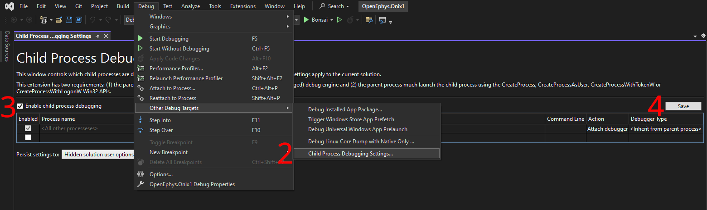
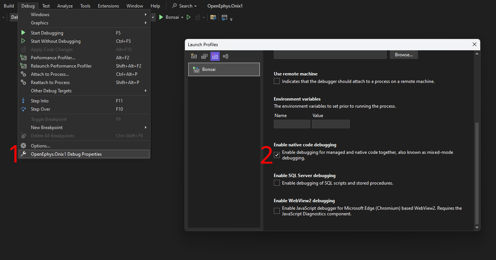

# Onix1 Bonsai Library
[Bonsai](https://bonsai-rx.org/) library for the [Open Ephys Onix
Acquisition System](https://open-ephys.github.io/onix-docs).

- Open Ephys store: https://open-ephys.org/onix
- Library documentation: https://open-ephys.github.io/bonsai-onix1-docs
- Hardware documentation: https://open-ephys.github.io/onix-docs

### Run in visual studio
1. Double click the `Setup.cmd` file in the `.bonsai` folder. This will install a
   portable version of Bonsai in the folder along with its required packages.
1. Open `OpenEphys.Onix1.sln` in Visual Studio (Community Edition is fine).
1. Select which project to compile and run Bonsai against.
   - `OpenEphys.Onix1`: core library (No GUI elements will be loaded)
   - `OpenEphys.Onix1.Design`: core library and GUI elements
1. Press the Play button to
   - Compile the library selected in step 3
   - Run the Bonsai application installed in step 1
   - Instruct Bonsai to load the compiled library

### Enable debugging

Enable child process debugging
1. Download and install [Microsoft Child Process Debugging Power Tool 2022](https://marketplace.visualstudio.com/items?itemName=vsdbgplat.MicrosoftChildProcessDebuggingPowerTool2022), or find the version of the power tool for the version of Visual Studio used
1. Navigate to child process debugging settings
1. Check `Enable child process debugging`
1. Click <kbd>Save</kbd>

Enable native code debugging
1.  Navigate to debug properties
1.  Check `Enabled native code debugging`

